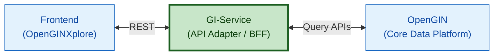

# GI-SERVICE

[](https://opensource.org/licenses/Apache-2.0)

**General Information Service** is a FastAPI-based backend service that acts as a middle-layer API adapter between **OpenGIN (Open General Information Network)** backend and the **OpenGINXplore** frontend application.

The service is responsible for communicating with OpenGIN APIs, processing and aggregating the retrieved government information, and exposing frontend-friendly endpoints tailored to OpenGINXplore’s data needs. It abstracts the complexity of OpenGIN’s data structures and delivers well-structured, optimized responses for visualization and exploration.

### Architecture


## Features

<!-- List your project features in a table format -->
| Feature | Description |
|--------|-------------|
| Active Ministries by Date | Provides an API to retrieve the list of ministries that were active on a given date, enabling time-aware views of government structures. |
| Active Departments by Ministry | Exposes endpoints to fetch departments active under a specific ministry for a given date, ensuring historically accurate organizational data. |
| Latest Dataset Access | Supplies various types of datasets (tabular) for the most recent available years, optimized for frontend consumption. |
| Prime Minister & Minister Details | Retrieves active Prime Minister details along with assigned ministers for a specified date, including portfolio associations. |
| Backend for Frontend (BFF) APIs | Acts as a dedicated BFF layer for the frontend, orchestrating parallel API calls to upstream services and returning frontend-ready responses. |


## Getting Started

### Prerequisites

- Python 3.8 to 3.13
- pip (Python package installer)
- Git

### Installation & Setup

**Clone the Repository**

   ```bash
   git clone https://github.com/LDFLK/GI-SERVICE.git
   cd GI-SERVICE
   ```

### Method 1 (Manual)
1. **Create Virtual Environment**

   ```bash
   # Create virtual environment
   python -m venv .venv

   # Activate virtual environment
   # On Windows:
   .venv\Scripts\activate

   # On macOS/Linux:
   source .venv/bin/activate
   ```

2. **Install Dependencies**

   ```bash
   pip install -r requirements.txt
   ```

3. **Environment Configuration**

   Create a `.env` file in the root directory:

   ```env
   # Base URLs for Read(Query) services in OpenGIN
   BASE_URL_QUERY=http://0.0.0.0:8081
   ```

4. **Run the Application**

   ```bash
   # Development server
   uvicorn main:app --reload --host 0.0.0.0 --port 8000
   ```

   The API will be available at: `http://localhost:8000`

### Method 2 (Docker)

   ```bash
   # Make sure docker daemon running
   
   # Up containers 
   docker compose up 

   # Build & Up containers
   docker compose up --build
   ```

## API Documentation

Once the server is running, you can access:

- **Interactive API Docs**: `http://localhost:8000/docs` (Swagger UI)
- **Alternative Docs**: `http://localhost:8000/redoc` (ReDoc)

## API Endpoints

- Organization Contract: [See Contract](gi_service/contract/rest/organisation_api_contract.yaml)
- Data Contract: [See Contract](gi_service/contract/rest/data_api_contract.yaml)

## Configuration

#### Environment Variables

| Variable | Description | Default |
|----------|-------------|---------|
| `BASE_URL_QUERY` | Query(Read) OpenGIN service URL | `http://0.0.0.0:8081` |

## Contributing

Please see our [Contributing](CONTRIBUTING.md).

## Code of Conduct

Please see our [Code of Conduct](CODE_OF_CONDUCT.md).

## Security

Please see our [Security Policy](SECURITY.md).

## License

<!-- Specify the license under which your project is distributed -->
This project is licensed under the MIT License - see the [LICENSE](LICENSE) file for details.

## References

- [OpenGIN](https://github.com/LDFLK/OpenGIN.git) 
- [OpenGINXplore](https://github.com/LDFLK/openginxplore.git)
